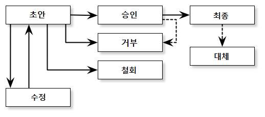

- 번호: 1
- 제목: WEP 목적과 작성 지침
- 작성자: 홍태민(taemin@kovi.com)

# WEP란 무엇입니까?

WEP는 Workflow Enhancement Proposal의 약자로 업무 흐름 개선안이란 뜻입니다. 여기서 업무는 소프트웨어 개발 업무로 한정합니다.

소프트웨어 개발자는 업무를 수행하는 과정에서 많은 규칙과 개발 프로세스를 따릅니다.
딱히 프로세스를 정립해 따르는 환경이 아닐지라도 명시화되어 있지 않을 뿐 구성원이 공유하는 정형화된 업무 흐름은 존재합니다.

WEP은 이런 일련의 업무 흐름을 개선하기 위한 제안서입니다.
문제를 해결하는 것보다 문제를 인지하고 이에 대한 공감대를 형성하는 것이 더 중요하다는 전제 아래, 최종적으로 구성원의 합의에 따른 개선 방법을 도출하는 것이 WEP의 목적입니다.

# 굳이 딱딱한 절차를 거쳐야 하나요?

아마도 처음엔 어떤 의견을 내기 위해 제안서를 쓰는 절차가 번거롭게 느껴질 겁니다.
얼굴을 마주 보며 이야기하는 것이 간편하고 훨씬 덜 관료적으로 다가오기도 합니다.
하지만 길게 봐야 합니다. 지속적인 개선을 구두로 지속하는 것은 불가능합니다.
말이 아니라 형식을 갖춘 문서를 작성하는 것으로 얻을 수 있는 효과는 매우 많습니다.

- 팀의 구성원은 바뀝니다. 말로 이루어진 개선은 제안자가 빠지면 금세 원래대로 돌아갑니다.
- 더 폭넓게 구성원의 의견을 청취할 수 있습니다. 말은 다수의 참여를 유지하기에 적절한 매체가 아닙니다.
- 생각은 처음엔 어설플 수밖에 없습니다. 여러 사람이 관찰하고 수정해야 이를 명료하게 다듬을 수 있습니다.
- 항상 개선의 여지는 있고 언제든 이 과정에 참여할 통로가 있다는 점을 구성원이 인지할 수 있습니다.
- 혁신은 그 단어가 가진 매력만큼이나 위험한 것이기도 합니다. 이런 절차는 변화의 고삐를 살짝 늦춰 거부감 없는 점진적인 변화가 되도록 돕습니다.

실제로 이 과정이 불편함을 야기한다면 절차를 간소화하는 방안을 제시해 언제든 바꿀 수 있습니다.

# WEP를 제출하려면 어떻게 하나요?

WEP을 작성하고 적용할 때는 일정한 절차를 따라야 합니다. 이 과정은 대략 아래와 같습니다.

1. 이슈 등록
1. WEP 작성 가능성에 관한 판단
1. WEP 초안 작성
1. WEP 등록
1. 토론
1. 승인/거부/유예 회의
1. 적용

위 절차에 따라 WEP 문서 상태는 아래와 같이 바뀝니다.

## 이슈 등록

모든 시작은 문제를 인지하는 것에서 시작합니다.
개발 과정에 꼭 필요한데 빠진 것이나 기존의 방법보다 더 나은(혹은 그래 보이는) 방법이 있다면 그 내용을 이슈로 등록합니다.
이슈 등록은 WEP를 작성하기 전에 반드시 거쳐야 하는 과정으로 다음과 같은 효과를 거둘 수 있습니다.

- WEP로 다뤄야 하는지 아닌지 초기에 판단을 내릴 수 있습니다.
- 이슈를 등록한 최초 제안자가 자기 생각을 확장하고 명료하게 정리하는 시간을 가질 수 있습니다.
- 해당 이슈를 구성원이 어떻게 생각하는지 미리 살펴볼 수 있습니다.

## WEP 작성 가능성에 관한 판단

어떤 이슈는 WEP가 처리하고자 하는 범위를 벗어날 수 있습니다.
예를 들어 개발 업무보다 행정 절차에 깊이 관련되거나 영향력을 행사할 수 없는 외부의 문제인 경우가 그렇습니다.
관리자는 이에 대해 판단을 내리고 최초 제안자에게 통지합니다.
만약 WEP로 작성할만한 이슈라면 관리자는 문서 작성을 위한 지침도 같이 제공하여 최초 제안자의 WEP 작성을 도와야 합니다.

## WEP 초안 작성

최초 제안자는 관리자의 지침에 따라 WEP를 작성합니다. 문서 작성자와 최초 제안자는 다를 수 있습니다.
작성자는 git 저장소를 fork하고 문서를 만듭니다. 작성이 끝나면 Pull Request를 보냅니다.
이때 주의할 것은 WEP 번호를 붙이면 안 된다는 점입니다.
문서 번호는 등록과정에서 관리자가 할당합니다.
관리자는 문서를 검토하여 충분히 내용이 완성되었다고 판단하면 이를 병합하고 아니라면 어떤 부분이 미미한지 작성자에게 알려 수정할 수 있도록 합니다.

## WEP 등록

관리자가 작성자의 Pull Request를 승인하고 문서번호를 할당하면 WEP 등록이 된 것입니다.
등록되면 관리자는 구성원에게 전부 메일을 보내 토론을 시작할 수 있도록 합니다.

## 토론

WEP가 등록되면 구성원은 이에 대해 자유롭게 토론할 수 있습니다.
메일이나 면담 혹은 이슈를 통한 토론도 가능합니다.
이 과정에서 작성자는 구성원의 의견을 수렴해 제안서를 수정하거나 철회할 수 있습니다.
작성과 마찬가지로 수정도 Pull Request를 통해 이루어지며 관리자는 수정사항을 다시 구성원에게 알립니다.

## 승인/거부 회의

충분한 시간을 거친 후에 최종 결정권자가 참석한 회의에서 문서 승인 여부를 결정합니다.
이 회의에서는 그동안에 이루어졌던 토론을 간략하게 정리하고 투표를 합니다.
최종 결정권자는 의견을 수렴하고 결과를 발표하며 관리자는 승인 여부를 즉시 제안서에 반영합니다.
최종 결정권자는 결론을 내리기 어렵다는 판단하에 유예 결정을 내릴 수 있습니다.
유예된 WEP는 다시 승인/거부 결정을 기다려야 합니다.
WEP에서 제시하는 지침을 시험 적용해봐야 하거나 외부 조건을 기다려야 하는 경우 등이 유예 요건에 해당합니다.
유예 결정을 내릴 때 최종 결정권자는 유예 이유와 차후 승인/거부 회의 일정을 명시합니다.

## 적용

승인된 WEP은 즉시 효력이 발생합니다.
구성원은 WEP이 제시한 방안을 따르며 제안서의 목적을 이루는 데 필요한 작업을 수행합니다.

# WEP를 쓸 때 지켜야 할 형식이 있나요?

좋은 WEP를 위해 권장하는 형식이 있습니다.
아래 항목은 필수로 들어가야 하는 항목입니다.

- 머리말: 제목, 작성자를 써넣습니다.
- 개요: 제안 내용을 간략하게 10줄 이내로 작성합니다.
- 해결책: 문제를 해결할 방법을 제시합니다.

아래 항목은 거의 반드시 들어가야 하지만 다루는 주제에 따라 생략도 가능합니다.
하지만 가능하다면 기재하는 것이 좋습니다.

- 동기: 제안서를 작성한 이유를 기재합니다.
- 근거: 해결책으로 얻을 수 있는 효과와 다른 대안에 비해 나은 점 등을 기재합니다.
- 참조: 문서를 쓰는데 참조한 자료나 관련 있는 WEP을 기재합니다.

이 외에 주의를 환기하기 위한 도입부나 제시한 해결책의 다른 대안도 작성자의 의도에 따라 삽입할 수 있습니다.

# WEP 관리자는 어떤 일을 하나요?

팀에는 반드시 WEP 관리를 담당하는 두 명 이상의 관리자가 있어야 합니다.
관리자를 새로 선출할 권한은 기존 관리자가 갖습니다.
관리 권한의 변동은 반드시 전체 구성원에게 알려야 합니다.
WEP 처리 과정에서 언급했듯이 관리자는 아래와 같은 일을 수행할 책임이 있습니다.

- 지속적인 이슈 관찰
- WEP 문의 사항에 대한 자세한 답변
- 초안에 대한 검토와 피드백
- WEP 변경 사항을 전체 구성원에게 공지
- 저장소 관리 및 백업

# WEP를 구상할 때 참조한 시스템이 있나요?

WEP는 아래 시스템에 강하게 영향을 받았습니다.

- PEP: Python Enhancement Proposal
- BIP: Bitcoin Improvement Proposal
- Go Project Design Documents
